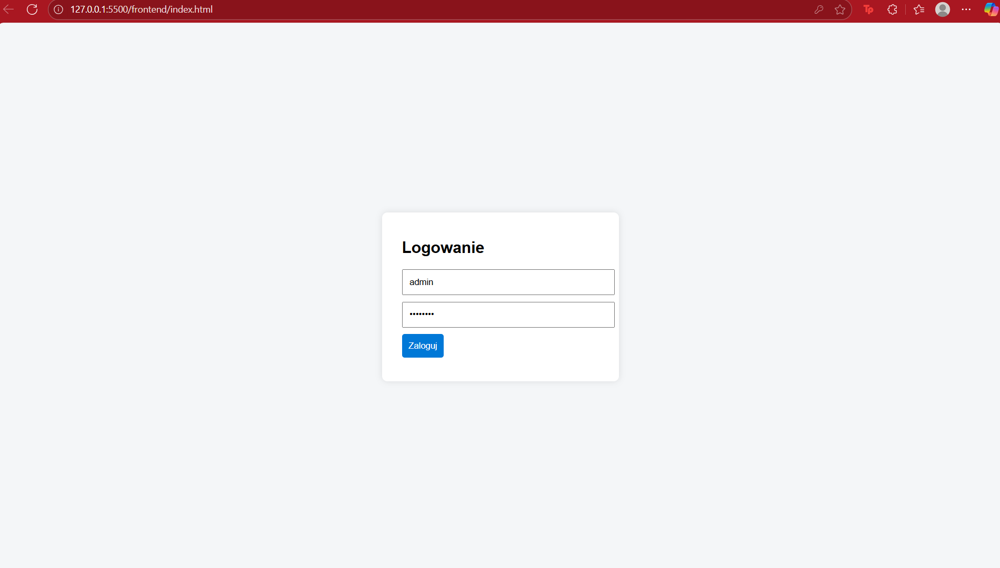
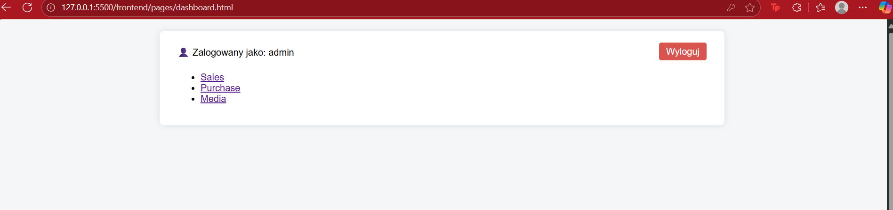
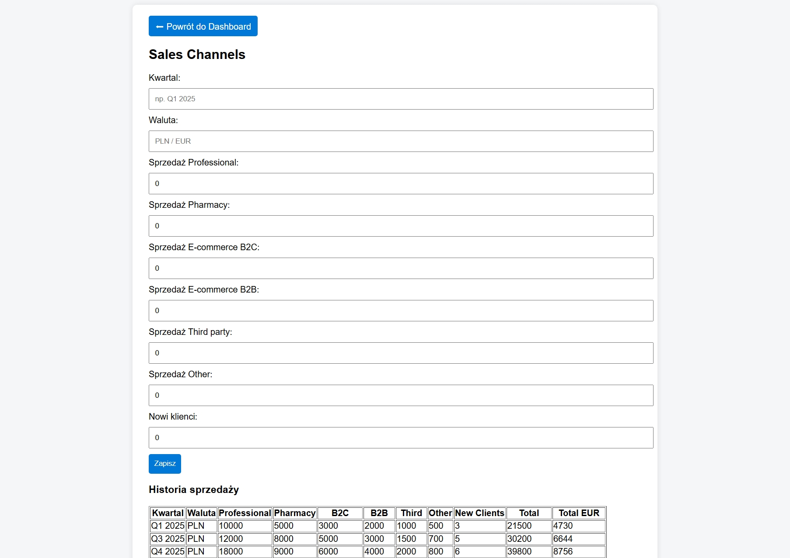
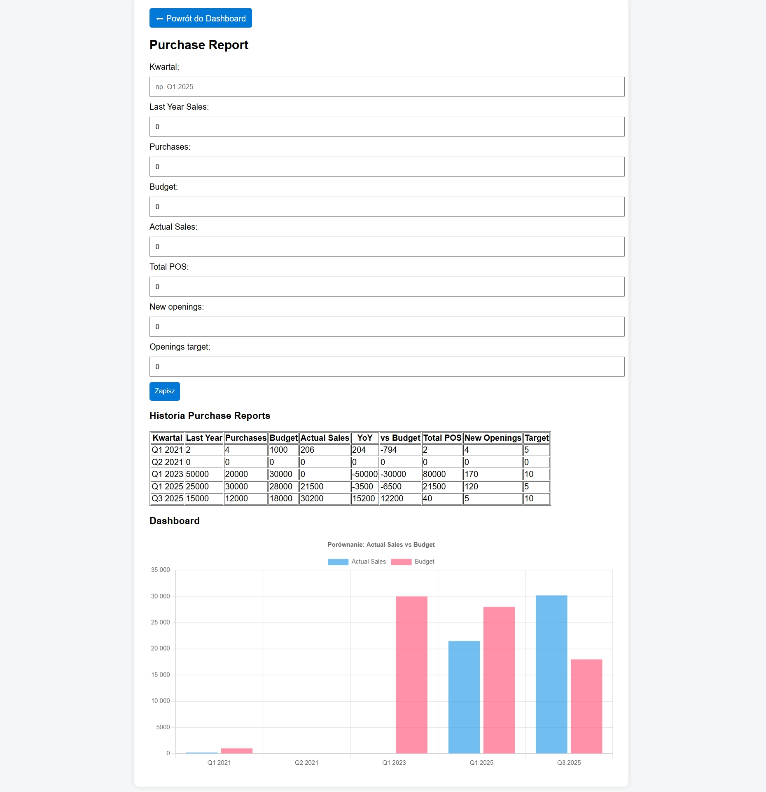
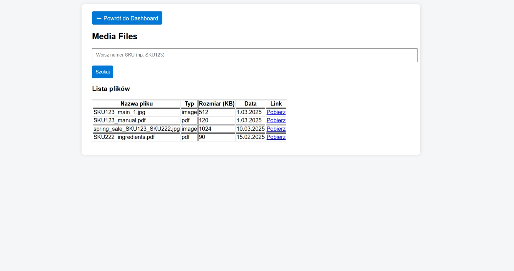

# Portal B2B dla Dystrybutorów – Case Study SKILL & CHILL

## 📌 Cel projektu
Celem projektu było stworzenie portalu B2B dla dystrybutorów firmy kosmetycznej. Portal umożliwia:
- logowanie i autoryzację użytkowników,
- raportowanie sprzedaży,
- monitorowanie zakupów i punktów sprzedaży,
- dostęp do materiałów marketingowych i produktowych,
- (docelowo) zarządzanie użytkownikami i logami.

Projekt został przygotowany jako część case study rekrutacyjnego – zawiera szczegółową dokumentację oraz działające MVP kluczowych funkcjonalności.

---

## 📖 Dokumentacja
Pełna dokumentacja znajduje się w katalogu **/docs**:
- `requirements.md` – wymagania biznesowe i techniczne  
- `design.md` – projekt architektury i modułów  
- `backend.md` – opis backendu  
- `frontend.md` – opis frontendu  
- `api.md` – specyfikacja API  

---

## 🏗️ Architektura
- **Backend:** ASP.NET Core (.NET 9, Minimal API), Entity Framework Core, SQLite (MVP), JWT  
- **Frontend:** HTML5, CSS3 (desktop-first, responsywny), JavaScript (fetch API, Chart.js)  
- **Komunikacja:** REST/JSON, HTTPS (docelowo)  

---

## ✅ Funkcje zrealizowane w MVP

### 🔐 Logowanie i autoryzacja
- JWT + role (`Employee`, `Distributor`, `ExportManager`, `Admin`, `SuperAdmin`)  
- Blokada po 3 nieudanych próbach logowania  
- Wymuszona zmiana hasła przy pierwszym logowaniu  
- Hierarchiczne odblokowywanie kont  

### 📊 Sales Channels
- Formularz kwartalny (Professional, Pharmacy, B2C, B2B, Third Party, Other)  
- Automatyczne sumowanie i wyliczenia (Total, EUR Total – uproszczony kurs)  
- Historia sprzedaży w tabeli  
- API: `GET /api/sales`, `POST /api/sales`  

### 🛒 Purchase Report
- Formularz kwartalny (Last Year, Purchases, Budget, POS, Openings)  
- Auto-powiązanie z Sales (Actual Sales)  
- Automatyczne obliczenia (vs Last Year, vs Budget)  
- Historia raportów + dashboard z wykresem  
- API: `GET /api/purchase`, `POST /api/purchase`  

### 📂 Media
- Lista plików z repozytorium  
- Wyszukiwarka po SKU  
- Pobieranie plików  
- API: `GET /api/media`, `GET /api/media/search`  

---

## 🚧 Elementy do rozwinięcia (Next Steps)
- Eksport danych do CSV (Sales, Purchase)  
- Panel Admina – zarządzanie użytkownikami, rolami, logami  
- Sortowanie i pobieranie wielu plików w Media  
- Raportowanie sprzedaży po SKU  
- Integracja z API NBP dla kursów walut  
- Import danych do formularzy (Sales)  
- Filtrowanie danych wg kraju/dystrybutora  
- Obsługa zastępstw Export Managerów  

---

## 🧪 Spójność dokumentacji z kodem
- Dokumentacja obejmuje pełny zakres wymagań z case study (Faza I i II).  
- MVP implementuje najważniejsze funkcjonalności: logowanie, role, Sales, Purchase, Media.  
- Część elementów (CSV, panel admina, raporty SKU) została opisana i zaplanowana jako kolejne etapy rozwoju.  

---

## 🎯 Ocena realizacji case study
- Kluczowe moduły case study (Sales, Purchase, Media + logowanie i role) zostały zrealizowane.  
- Dokumentacja opisuje całość projektu i kolejne etapy rozwoju.  
- MVP stanowi działający szkielet systemu, który może być stopniowo rozwijany.  

---

## 📸 Screenshots

### 🔐 Logowanie
Ekran logowania z weryfikacją hasła i wymuszoną zmianą przy pierwszym logowaniu.  

### 🏠 Dashboard
Widok startowy po zalogowaniu, z dostępem do przypisanych modułów.  

### 📊 Sales Channels
Formularz do raportowania sprzedaży w różnych kanałach dystrybucji.  

### 🛒 Purchase Report
Moduł raportowania zakupów i punktów sprzedaży, z dashboardem i wykresami.  

### 📂 Media
Repozytorium materiałów marketingowych i produktowych z wyszukiwarką po SKU.  

